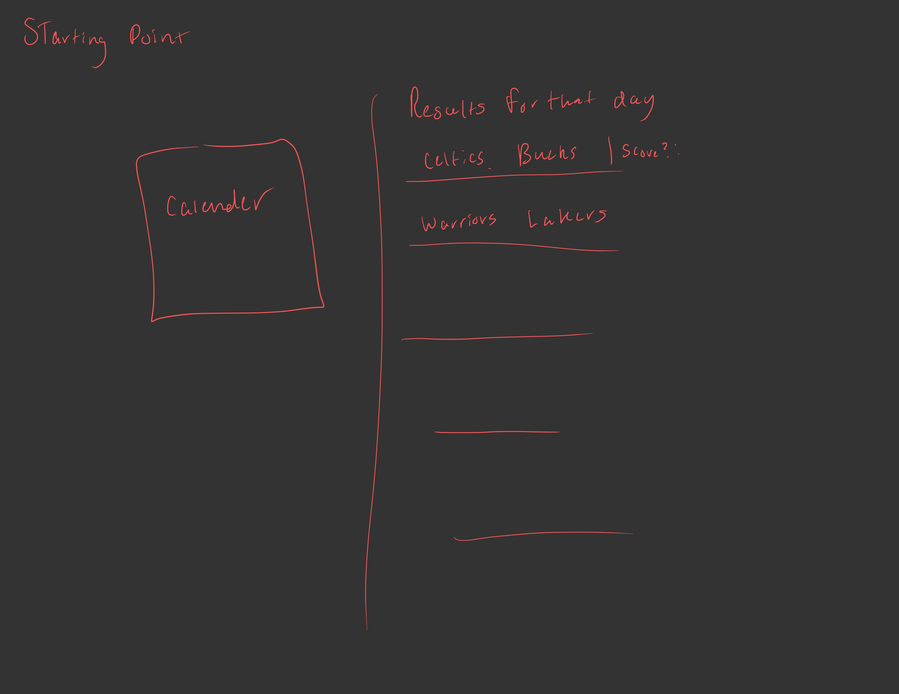
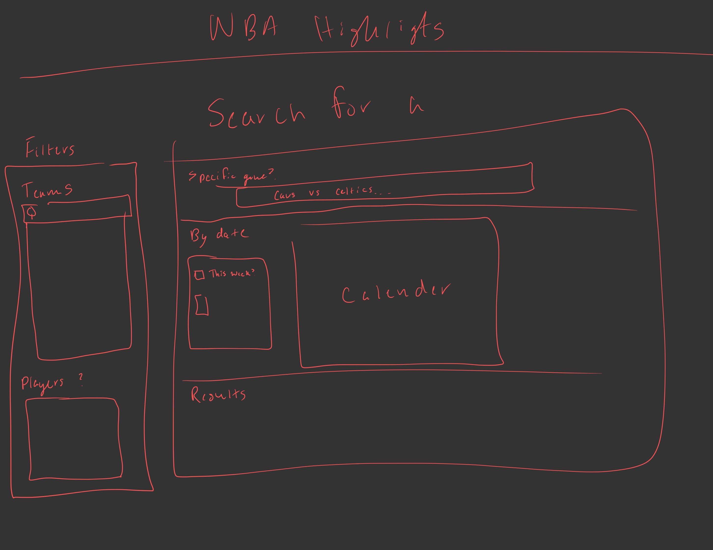
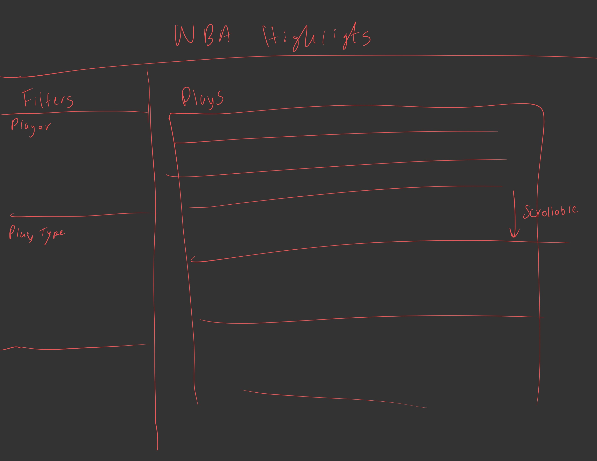
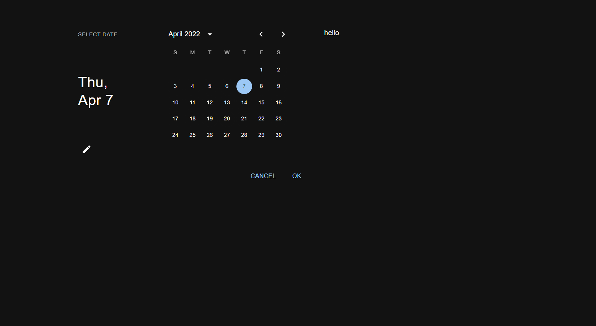
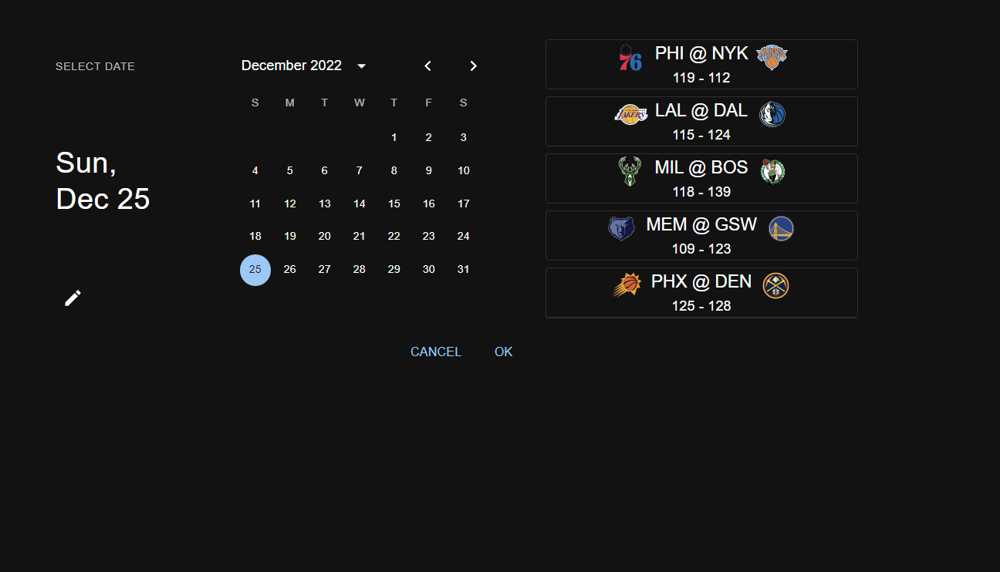

### Sam DeFrancisco

# NBA Highlight Maker

## Connecting Play By Play to Highlights

The first thing to figure out was how to connect play by play information recieved from one endpoint to highlight information recieved from another.

Each play in a game is defined by an `actionNumber` using this base url

```
url = f"https://cdn.nba.com/static/json/liveData/playbyplay/"
```

We can append on the game id and recieve a large json response for every single play in the game like so

```
url = f"https://cdn.nba.com/static/json/liveData/playbyplay/playbyplay_{gameID}.json"
```

Starting off I decided to just get this working for one game. Suns vs Clippers that had a game ID of `'0022200885'`. Since my plan here was to just create a highlight reel of all makes in a game to start off I passed paramaters in my test like so

```python
gameID = '0022200877'
params = {
    'GameID': gameID, # not required,
    'ContextMeasure': 'FGM',
    'Month': '0', # required //
    'OpponentTeamID': '0', # required //
    'Period': '0', # required //
    'PlayerID': '0', # required nullable
    #'RangeType': '0', # not required
    #'Season': '2022-23', # not required
    #'SeasonType': 'Regular Season', # not required
    #'StartPeriod': '0', # not required
    #'StartRange': '0', # not required
    'TeamID': '0', # required //
}
```

`ContextMeasure` filtered to only return play by play for each make in the game. From there I grabbed the action number from the json object to use here in a second.

## Game Clips

```python
base_video_url = f'https://videos.nba.com/nba/pbp/media/{year}/{month}/{day}/{gameID}/{action_number}/{large unique hex string}.mp4'
```

This is an example of what a url for a game clip looks like. The large unique hex string at the end became a roadblock as I had no way of finding any pattern or doc to what they meant. My og plan was to just replace the action_number with the information we got from play-by-play. This was leading to deadend urls b/c of that unique hex string. At first I assumed that string would be the same for the whole game but this was not the case.

In came swars nba api on github. Recently someone discovered the `VideoAssetDetails` endpoint which has information needed for highlight urls. Luckily, it provides those unique hex strings for the url. So now I just needed to match up these urls to the action plays

---

**Getting URLS from stats.nba.com's videodetailAsset**

```py
response = requests.get('https://stats.nba.com/stats/videodetailsasset', params=params, headers=headers)

with open("videos1.txt", "w") as f:
  f.write(json.dumps(response.json(), indent=1))
#print(response.content)

urls = response.json()['resultSets']['Meta']['videoUrls']

#make_urls = []

action_hex = {}

# parse uid for each action number
for element in urls:
    if element['lurl'] != None:
        # 'https://videos.nba.com/nba/pbp/media/2023/02/16/0022200885/9/e89c8c5a-78bb-4a1d-08af-b36491bffeda_1280x720.mp4'
        # ['9/', 'e89c8c5a-78bb-4a1d-08af-b36491bffeda_1280x720.mp4']
        # ['9', 'e89c8c5a-78bb-4a1d-08af-b36491bffeda_1280x720.mp4']
        split = element['lurl'].split(f'{gameID}/')[1].split("/")
        action_hex.update({split[0]: split[1]})
        #make_urls.append(element['lurl'])
```

Using Pythons split function I created a dictionary that took the form of

```json
{ "actionNumber": "unique_hex_string" }
```

Now we could return to the play by play data from earlier and pair up each play with its highlight url

```python
base_video_url = f'https://videos.nba.com/nba/pbp/media/{year}/{month}/{day}/{gameID}/'
for action in actions:
  if(action['isFieldGoal']):
    #print(json.dumps(action, indent=1))
    if(action['shotResult'] == 'Made'):
      act_num = action['actionNumber']
      vid_url = base_video_url + f'{act_num}/' + action_hex.get(f"{act_num}")
      print(f"#{action['actionNumber']} {action['description']} {vid_url}")
      desc_vid.update({action['description']: vid_url})
```

The description part of the dictionary are just str that describe the play for example

```
J. Tatum 25' 3PT pullup (36 PTS)
```

So our dictionary now contained

```json
{
  "J. Tatum 25' 3PT pullup (36 PTS)": "https://videos.nba.com/nba/pbp/media/2023/02/15/0022200877/453/d6c1e2d1-fb05-0510-5a78-4bfff1fa4b93_1280x720.mp4"
}
```

# Lets Get More Games!

> Obviously we don't want to create all of this just for one game. So first we needed to find the GameIDS for every game that's happened this season

Using the `leaguegamelog` endpoint from stats.nba.com we were able to grab all the games from this season using this url

```python
url = "https://stats.nba.com/stats/leaguegamelog?Counter=0&DateFrom=&DateTo=&Direction=ASC&LeagueID=00&PlayerOrTeam=T&Season=2022-23&SeasonType=Regular+Season&Sorter=DATE"
```

Which I then dumped into a text file for parsing, rather than having to make this request multiple more times in the near future

```python
with open("games_2023_test.txt", "w") as f:
    f.write(json.dumps(json_response['resultSets'][0]['rowSet'], indent=1))
```

What we wrote to the text file was a python list of games from the season, rather than a dictionary.

---

## Parsing

```python
with open("games_2023_list.txt", "r")  as f:
    content = f.read()
    parsed_data = json.loads(content)

GAME_ID = 4
GAME_DATE = 5
GAME_VS = 6

games = {}
for i in range(0, len(parsed_data), 2):
    game = parsed_data[i]
    #print(f"{game[GAME_ID]} {game[GAME_DATE]} {game[GAME_VS]}\n")
    games.update({game[GAME_ID]: f"{game[GAME_DATE]} {game[GAME_VS]}"})
```

Here we have a dictionary that looks like

```json
 {"0022200745": "2023-01-28 LAC @ ATL",...}
```

This isn't really very suitable for the interface I want to end up creating. Instead I want to be able to view all the games from a certain date, and then grab its ID for finding highlights.

While doing this i remembered of a resource i used in a past project [GoSports]() that had pretty much done this for me. [LeagueSchedule.json](https://cdn.nba.com/static/json/staticData/scheduleLeagueV2.json)

```python
import requests
import json

data = requests.get("https://cdn.nba.com/static/json/staticData/scheduleLeagueV2.json", headers=headers)

data = data.json()
schedule = data.get('leagueSchedule').get('gameDates')
# create dictionary of format {'game-date': gamesList}
schedule_dict = {}
for day in schedule:
    schedule_dict.update({f"{day.get('gameDate')}": day.get('games')})

with open("games_nba_endpoint.txt", "w") as f:
    f.write(json.dumps(schedule_dict))
```

W/ That resource I made the request and wrote the useful part of the response to a txt file as the request itself took awhile to complete.

Now back to parsing the data to a format like we wanted. `{gamedate}: [gamelist]}`

```python
# For each day create a list of the games for that day
for day in parsed_data:
    games = parsed_data.get(day)
    game_list = []
    # for each game append to game_list
    # {gameID: "away @ home"} EX {'0022201213': 'DEN @ UTA'}
    for game in games:
        game_list.append({game['gameId']: f"{game['awayTeam']['teamTricode']} @ {game['homeTeam']['teamTricode']}"})
    # {'09/30/2022':[games list]}
    day_games.update({day.split(" ")[0]: game_list})
```

**Result**

```json
{
"09/30/2022": [{"0012200001": "GSW @ WAS"}, {"0012200002": "MRA @ LA"}]
...
}
```

---

# Reformatting Our Code

> At the moment our code for grabbing highlights is not very useable when it comes to flexability as there is a lot of hardcoding and no methods

## playbyplayToURLs

Started by seperating our two current actions into their own methods

- `getActionNumberToURLs()`

```python
def getActionNumberToURLs(gameID: str) -> dict:
  params = {
    ...
  }

  response = requests.get('https://stats.nba.com/stats/videodetailsasset', params=params, headers=headers)
  urls = response.json()['resultSets']['Meta']['videoUrls']
  action_hex = {}

  # parse uid for each action number
  for element in urls:
      if element['lurl'] != None:
        # update action_hex w/ {'act_num': 'url'}
  return action_hex
```

- `getPlayByPlayWithUrl()`

```py
def getPlayByPlayWithUrl(gameID: str, year: str, month: str, day: str) -> dict:
  url = f"https://cdn.nba.com/static/json/liveData/playbyplay/playbyplay_{gameID}.json"
  response = requests.request("GET", url, headers=headers)
  json_response = response.json()

  # Gets only each play from the game, excludes meta and headers
  actions = json_response['game']['actions']
  action_hex = getActionNumberToURLs(gameID=gameID)
  desc_vid = {}

  # Base highlight url, will be appended to
  base_video_url = f'https://videos.nba.com/nba/pbp/media/{year}/{month}/{day}/{gameID}/'
  for action in actions:
        # match play w/ url
  return desc_vid

```

Our code now can take in any gameID/gamedate from 2023 and return the descriptions of each play along with the highlight URL

---

# Creating a Highlight Reel Using our New Code

## createMakesVideo.py

Now taking advantage of `moviepy` we can download each clip temporarily and concat all of them together to get a highlight reel of all makes in a game

**Imports**

```python
from playbyplayToUrls import getPlayByPlayWithUrl
from moviepy.editor import VideoFileClip, concatenate_videoclips
import requests
import tempfile
import os
from time import sleep
```

`moviepy` needs to be installed

```
pip install moviepy
```

**main**

```python
def main():
    print("getting plays")
    plays = getPlayByPlayWithUrl(gameID='0012200005', year='2022', month='10', day='02')
    print("Got plays")

    with tempfile.TemporaryDirectory(prefix="temp_nba_clips_") as temp_dir:
        clips = []
        i = 1
        for play in plays:
            print(f"Getting play ({i}/{len(plays)})\n")
            response = requests.get(plays.get(play))
            clip_filename = os.path.join(temp_dir, f'{i}.mp4')
            with open(clip_filename, 'wb') as f:
                f.write(response.content)
            #print(plays.get(play))
            clip = VideoFileClip(clip_filename)
            clips.append(clip)
            sleep(.5)
            i += 1
            # if i == 20:
            #     break

        final_clip = concatenate_videoclips(clips)
        # for clip in clips:
        #     clip.close()
        final_clip.write_videofile("celtics_hornets.mp4")

```

One issue I am running into is writing the larger file. For some reason past around 16 clips we get a weird error claiming that the clips directory does not exists. If its under 16 we finish execution with no issue. Past that we still finish and build the video as well as write it, but at the end we get a weird error.

The other thing you might notice is this code is currently only working for one specific game. Next we want to take advantage of the parsing we did earlier to be able select a date, then choose a game for our code to create the highlight reel of.

## Fix

To hell with tempfile.Temp.. it is only causing issues, instead I changed routes and manually created the temp folder and then deleted it myself

```python
import shutil
dir_path = 'temp_clips_folder'
if not os.path.exists(dir_path):
    # create temp dir
    os.makedirs(dir_path)
    print(f"Directory {dir_path} created")

...

# later delete

# delete directory
if os.path.exists(dir_path):
    shutil.rmtree(dir_path)
    print(f"Directory {dir_path} deleted")
```

**make sure to import `shutil`**

WELP

Still not fixed... but we finally got it. The process that was using the file was us. our python file. I was not closing each indivual clip... but it finally works

```python
final_clip = concatenate_videoclips(clips)
final_clip.write_videofile("../mp4s/celtics_hornets2.mp4")
for clip in clips:
    print("closing clip")
    clip.close()
final_clip.close()
```

---

# Reformatting directories

> One thing that is bothering me is everything is currently living in one directory, time to fix that

```
C:.
|   .gitignore
|   README.md
|
+---docs
|       proccess.md
|
+---mp4s
|       celtics_hornets.mp4
|       celtics_hornets2.mp4
|       video.mp4
|
+---scripts
|   |   celtics_hornets2TEMP_MPY_wvf_snd.mp3
|   |   createMakesVideo.py
|   |   gameLog.py
|   |   game_parser.py
|   |   nbaTest.py
|   |   nba_games_endpoint.py
|   |   playbyplayToUrls.py
|   |
|
+---txt
|       actions.txt
|       games_nba_endpoint.txt
|       params.txt
|       reponse_playbyplay.txt
|       videos.txt
|       videos1.txt
|
\
```

---

# Frontend

Now were gonna create a simple frontend for making calls to our backend. Start with getting react setup on windows

**Update npm**

```
npm install -g npm
```

**Install create-react-app**

```
npm install -g create-react-app
```

```
cd projects/highlight_maker/frontend/
```

**Create react app**

```
npx create-react-app nba-frontend
```

**Install mui**

```
npm install @mui/material @emotion/react @emotion/styled
```

---

## Remove clutter

Delete all the uneccesary stuff, left with `App.js`, `index.js`

Create components folder in `src`

---

## Creating Landing Screen

### Inital Prototypes

- Starting point



- Later on Landing page



- Later On results page



That leaves us with some work to do. Lets start on our initial starting point.

## What We need to do

### Frontend

- We need to create a split grid that has this calender on one side
  - Eventually it needs to store the date choosen and make a request to our currently non-existing backend
  - The backend will then return list of games functionallity froim game_list_for_date.py
- On the other side we need to create a static results list

### Calendar

Mui is the best. They have like 10 different date pickers to choose from. Heres what i went with

**Initial installion**

```npm
npm install @mui/x-date-pickers
```

```npm
npm install moment
```

```
npm install dayjs
```

**React Code**

Imports

```js
import * as React from "react";
import dayjs from "dayjs";
import TextField from "@mui/material/TextField";
import { AdapterDayjs } from "@mui/x-date-pickers/AdapterDayjs";
import { LocalizationProvider } from "@mui/x-date-pickers/LocalizationProvider";
import { StaticDatePicker } from "@mui/x-date-pickers/StaticDatePicker";
```

Component

```js
const isWeekend = (date) => {
  const day = date.day();

  return day === 0 || day === 6;
};

export default function StaticDatePickerLandscape() {
  const [value, setValue] = React.useState(dayjs("2022-04-07"));

  return (
    <LocalizationProvider dateAdapter={AdapterDayjs}>
      <StaticDatePicker
        orientation='landscape'
        openTo='day'
        value={value}
        onChange={(newValue) => {
          setValue(newValue);
        }}
        renderInput={(params) => <TextField {...params} />}
      />
    </LocalizationProvider>
  );
}
```

Result



---

### Backend

- Recieve date, parse it into format we are using for our dictionaries
- Get games on that date
- Return Json respose of list of games

## Quick fastAPI setup

fastAPI is good for setting up a quick backend. At the moment ours doesn't need to be doing anything crazy.

**Imports**

```python
from fastapi import FastAPI, Body, HTTPException
from fastapi.middleware.cors import CORSMiddleware
from fastapi.responses import JSONResponse
from pydantic import BaseModel, Field
from get_schedule import get_games_on_date
from datetime import datetime
import json
```

**Data model for recieving post requests, allowed requesters**

```python
class DateStr(BaseModel):
    value: str

origins = [
    "http://localhost:3000/",
    "localhost:3000"
]

app.add_middleware(
    CORSMiddleware,
    allow_origins=["*"],
    allow_credentials=True,
    allow_methods=["*"],
    allow_headers=["*"]
)
```

**Request reciever**

```python
# start backend
app = FastAPI()

# Post request reciever
@app.post("/date")
async def get_games_on_date_controller(data: DateStr):
    date = fix_date(data.value)
    return JSONResponse(content=get_games_on_date(date))

# starts server when python file is run
if __name__ == "__main__":
    import uvicorn
    uvicorn.run(app, host="localhost", port=8000)
```

At this point there has been some changes to our scripts to have easier use of our data on the frontend

**What we had**

```
{

    '12/25/2022': [
                    ['0022200493', 'PHI@NYK', '119-112'],
                    ['0022200494','LAL@DAL', '115-124],
                    ...
                  ]
}
```

**What We Changed Too**

```
'12/25/2022':
[
 {
  "gameID": "0022200514",
  "homeTeamID": 1610612758,
  "awayTeamID": 1610612743,
  "matchup": "DEN @ SAC",
  "score": "113 - 106"
 }
 ...
 ...
]
```

This is what allows us to use `return JSONResponse(content=get_games_on_date(date))`
and is much more suitable overall rather than indexing with numbers which isn't very readible in a code sense.

---

## Making Calls to our new backend

This is never an easy task I have seem to have found out. Axios seems to be the easiest way of doing it that I have discovered, but next time im going to give `fetch()` another try.

Anyways my main plan here was to take advantage of our MUI calendar's onChange hook. Inside of that I pass the new value (the date) into our function that makes the post request to our backend

**Calendar Comp**

```js
<StaticDatePicker
  orientation='landscape'
  openTo='day'
  value={this.state.value}
  onChange={(newValue) => {
    this.setState({ value: newValue });
    this.submitMessageAxios(newValue);
  }}
  renderInput={(params) => <TextField {...params} />}
/>
```

**Function that makes Post Request**

```js
submitMessageAxios = (e) => {
  //for json
  const data = {
    value: e.toString(),
  };
  axios
    .post("http://localhost:8000/date", data)
    .then((response) => {
      // when we have games returned
      // save the data from the response (an array) into a state var
      if (response.data !== "no games") {
        this.setState({ responseData: response.data, shouldRender: true });
      } else {
        // no games, don't render the
        // list of games..
        this.setState({ shouldRender: false });
      }
    })
    // do absolutley nothing w/ the error :)
    // for nowwwww
    .catch((error) => {
      console.log(error);
    });
};
```

---

## Frontend Progress

So now when we make a request to our backend using what we have done we get a response. If there is games its a list of `JSON` objects and if we don't we get a string 'no games'

Heres what it looks like when we do!



**Looking quite similar to our inital proto from above! :)**

Our next steps are going to get maybe sort of brutal. Our plan here is to be able to click one of those games and then be routed to a page where we can click each indivual play and be directed to the nba highlight. The problem there is the keyword route. AKA learning how to use React routing :)
